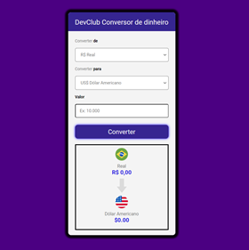

<h1>Convert-Money</h1>

Neste projeto eu usei ,<strong>Html, Css e JavaScript, </strong> coloquei em pratica muito do que aprendi.

O projeto tem como objetivo converte real em 4 moedas sendo elas o Euro, Dólar, Bitcoin e o proprio Real <strong>Os valores usados são ficticios</strong>

In this project I use,<strong>Html, Css and JavaScript,</strong> put much of what I learned into practice.

The project aims to convert reais into 4 currencies, namely the Euro, Dollar, Bitcoin and the Real itself <strong>The values used are fictitious</strong>

